This is part of the documentation for [UWOT](https://github.com/jlmelville/uwot).

By default, `uwot` uses some conservative settings during the stochastic 
gradient descent. But there are some options that can speed things up:

* `n_sgd_threads = "auto"` (or any value greater than one): this is the biggest
thing you can do to speed up optimization. The optimization is now spread
across multiple threads. The `"auto"` setting sets the value to that used in
the other multi-threaded part of the code, which is controlled by `n_threads`.
The downside to using multiple threads is that you can no longer guarantee the
reproducibility of the results. Normally, you would expect the same results if
you called `set.seed` before each run. This will not be the case if set 
`n_sgd_threads`.
* `pcg_rand = FALSE`: the default random number generator used in the 
optimization is taken from [the PCG family](http://www.pcg-random.org/). This
is quite fast and has good statistical properties. An alternative PRNG is 
an implementation of the Tausworthe "taus88" generator, which is used in the
Python implementation of UMAP and which I have translated from Python into C++.
By setting `pcg_rand = FALSE`, you will get the taus88 generator. This is 
faster than PCG, but bear in mind that PCG was designed by computer science
professor [Melissa O'Neill](https://www.cs.hmc.edu/~oneill/index.html), and the
taus88 implementation was translated into C++ by me (I am not a computer science
professor), so if you have any concerns about the possibility of artifacts from
bad random number generation, stick with PCG. Nonetheless, it probably gives
results similar to that in the Python UMAP implementation most of the time.
* `approx_pow = TRUE`: the UMAP gradient requires some power calculations, which
are quite slow compared to other arithmetic operations. An 
[approximation to pow by Martin Ankerl](https://martin.ankerl.com/2012/01/25/optimized-approximative-pow-in-c-and-cpp/)
can give a noticeable speed up.
* `fast_sgd = TRUE`: this just sets all three of the above options at once, to 
make life a bit easier.

If you need reproducibility (e.g. for scientific/publication purposes), then using
multiple optimization threads is a deal-breaker. But for visualization purposes
or if reproducibility isn't that important to you, then these settings can
give a meaningful speed up of the performance of `uwot`, without hurting the
quality of the layout.

To prove it, here are some images of embeddings with the fast settings on and
off. On the left are images with the optimization settings left in their default
(slower) values. I also use PCA to reduce the dimensionality to 100:

```R
set.seed(1337)
mnist_umap_slow <- umap(mnist, pca = 100, verbose = TRUE)
```

On the right are the embeddings from using `fast_sgd = TRUE`:


```R
set.seed(1337)
mnist_umap_fast <- umap(mnist, pca = 100, fast_sgd = TRUE, verbose = TRUE)
```

Six threads were used in the stochastic gradient descent.

For details on the datasets, see the 
[examples](https://jlmelville.github.io/uwot/umap-examples.html) page. The 
timings are given in the title, in minutes and seconds. Note that this is for
entire run, not just the optimization phase, i.e. it includes the PCA
dimensionality reduction and nearest neighbor search, which is usually the
slowest part of the run and which is not affected by `fast_sgd`.

### mnist

|                             |                           |
:----------------------------:|:--------------------------:
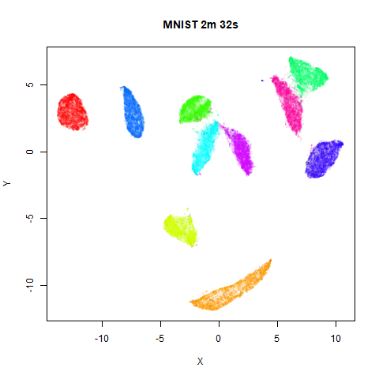|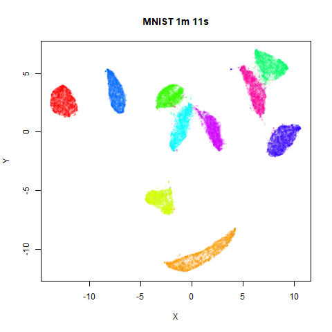

### fashion

|                             |                           |
:----------------------------:|:--------------------------:
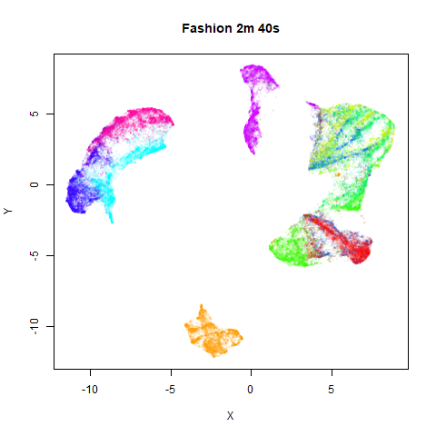|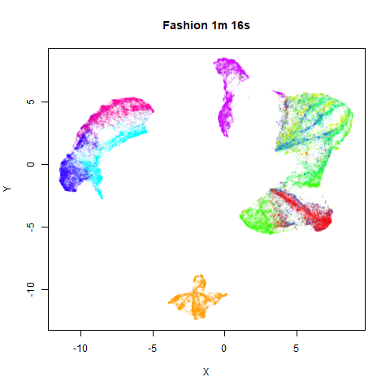

### kuzushiji

|                             |                           |
:----------------------------:|:--------------------------:
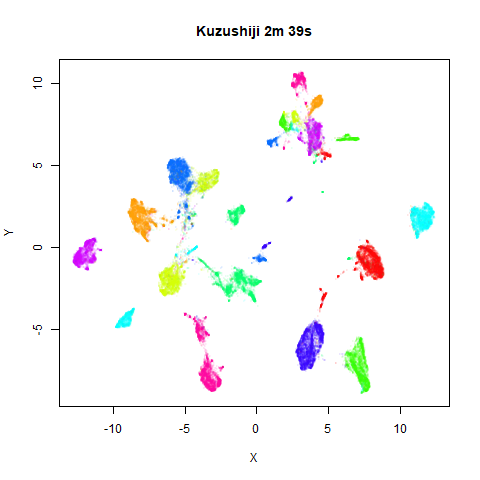|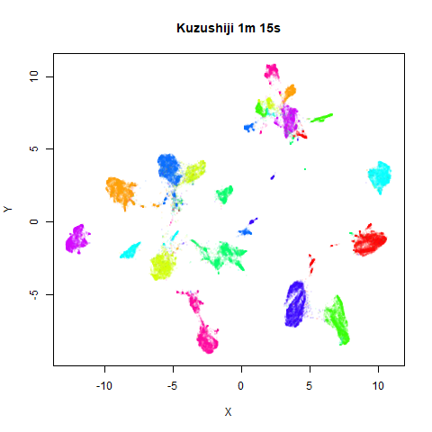

### norb

|                             |                           |
:----------------------------:|:--------------------------:
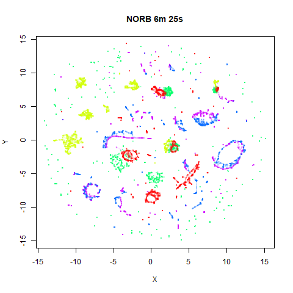|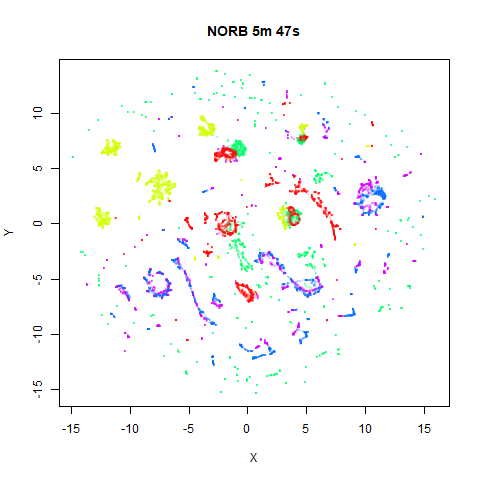

The distribution of clusters here does a look a little bit different, but I
think it's within the variation that one would expect from the stochastic nature
of the optimization. To bolster my point, here are two further runs of UMAP
on the NORB dataset with `fast_sgd = FALSE` and different seeds:

|                             |                           |
:----------------------------:|:--------------------------:
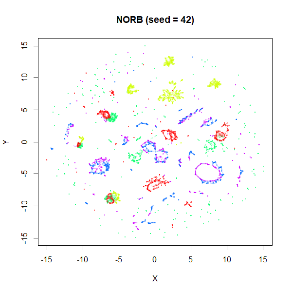|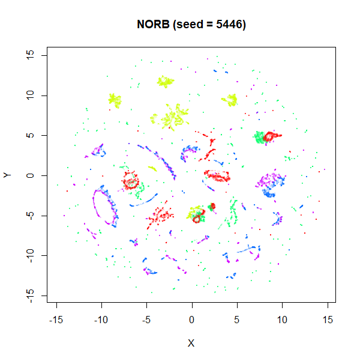

I think if you didn't know one of these four images was generated with the fast
settiings, you'd be hard pressed to pick it out of the line up. The variation 
between images is more likely due to the default `n_neighbors` being too low to
capture the global structure. Here's some plots with `n_neighbors = 150`, and
`n_epochs = 500` to account for the increased number of edges that need
sampling:

|                             |                           |
:----------------------------:|:--------------------------:
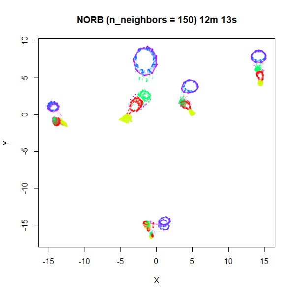|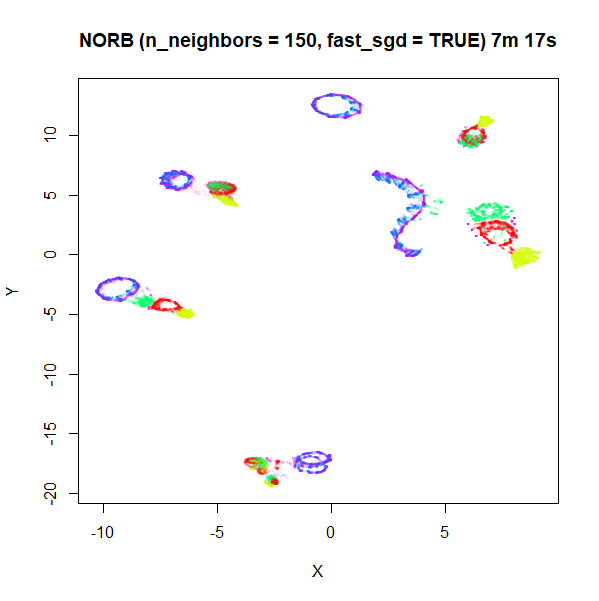

Apart from one of the blue loops being open in the `fast_sgd = TRUE` result, 
which is probably fixable with a longer optimization, the global arrangement 
of the two plots is pretty similar.

### tasic2018

|                             |                           |
:----------------------------:|:--------------------------:
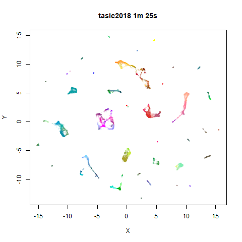|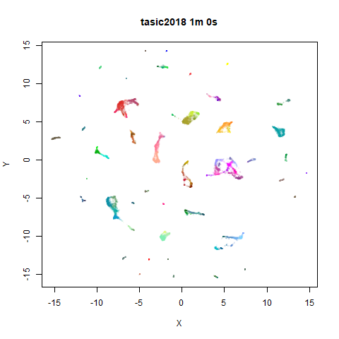

### macosko2015

|                             |                           |
:----------------------------:|:--------------------------:
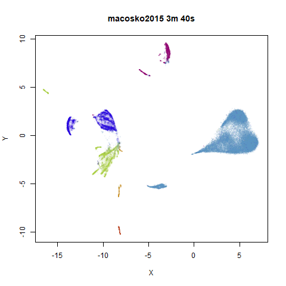|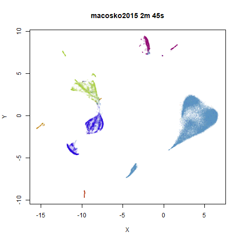

From these results, I'd say that the `fast_sgd = TRUE` settings give results
which are effectively indistinguishable from the slower settings, so if you want
to save a bit of time, there seems no harm in using them. The actual time
savings you'll see depend on how long the nearest neighbor search takes, and any
initial PCA you carry out on the input (as we do in all these examples) can take
a fair amount of the run time. For example on NORB, the PCA takes up 5 minutes of
the six-and-a-half minute total run time, so there's not a lot of time to be
saved. But for MNIST and Fashion, you can effectively halve the run time (with 
six threads, anyway).
