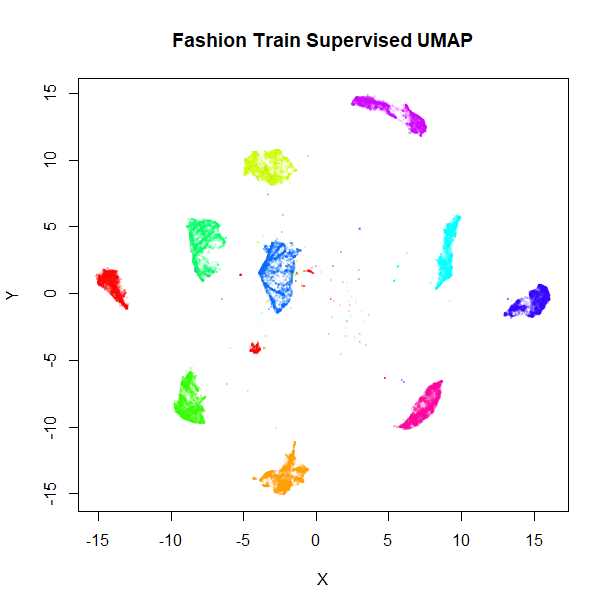
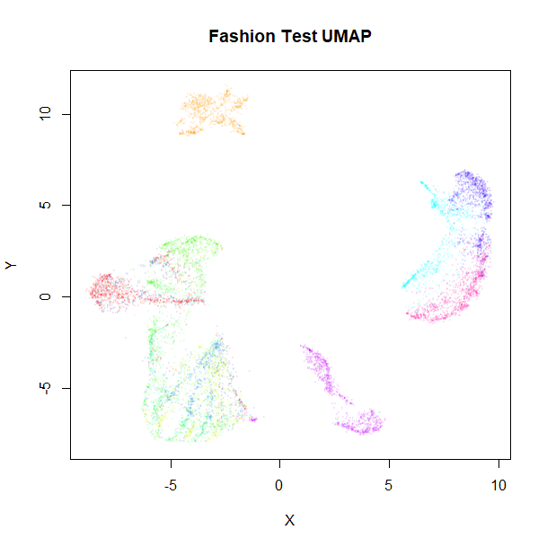
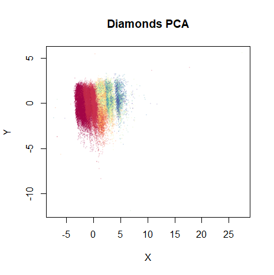
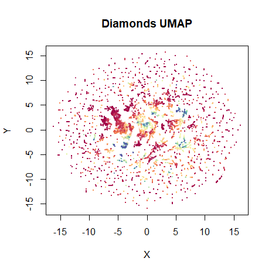
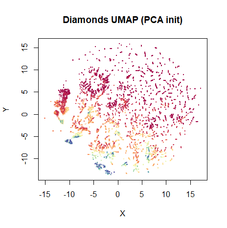
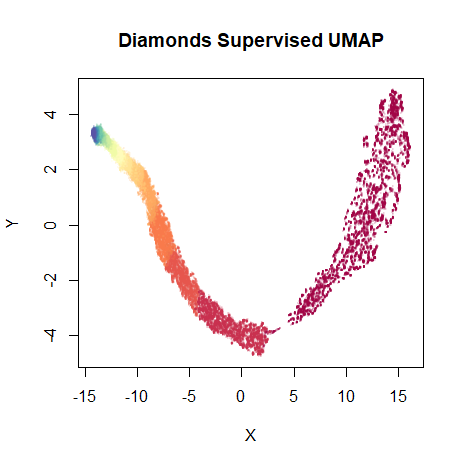

This is part of the documentation of [uwot](https://github.com/jlmelville/uwot).

Among other things, UMAP provides two interesting extensions to its basic
dimensionality reduction. First, it can do a supervised embedding, where 
labels (or numeric values) are leveraged so that similar points are closer
together than they would otherwise be. Second, it can do metric learning, by
embedding out-of-sample points based on an existing embedding. 

This document shows how to do it in `uwot`, but more information is
available in UMAP's 
[documentation](https://umap-learn.readthedocs.io/en/latest/supervised.html).

The example dataset used is 
[Fashion MNIST](https://github.com/zalandoresearch/fashion-mnist). One way
to download it in uwot-ready form is:

```R
devtools::install_github("jlmelville/snedata")
fashion <- snedata::download_fashion_mnist()
```

The Fashion MNIST dataset contains 70,000 images of fashion items, in one of ten
classes. A factor column, `Label` contains the id of each item (from `0` to `9`)
for backwards compatibility with the MNIST dataset, which Fashion MNIST is
designed to be a drop-in replacement for. A more descriptive, but entirely
equivalent, factor column, `Description` provides a short text string to
describe the classes, e.g. the `Description` `"Coat"` and the `Label` `4` are
equivalent.

### Visualization

To produce the plots below, I used my 
[vizier package](https://github.com/jlmelville/vizier), which can be installed
using:

```R
devtools::install_github("jlmelville/vizier")
```

I'll show the commands to produce the plots before they are displayed.

## Supervised Learning

We'll compare the supervised result with a standard run of UMAP:

```R
set.seed(1337)
fashion_umap <- umap(fashion)
```

For supervised learning, provide a suitable vector of labels as the `y` argument
to `umap` (or `tumap`):

```R
set.seed(1337)
fashion_sumap <- umap(fashion, y = fashion$Description)
```

Let's take a look at the results, the unsupervised embedding on the left, and
the supervised version on the right:

```R
vizier::embed_plot(fashion_umap, fashion, cex = 0.5, title = "Fashion UMAP", alpha_scale = 0.075)
vizier::embed_plot(fashion_sumap, fashion, cex = 0.5, title = "Fashion Supervised UMAP", alpha_scale = 0.075)
```

|                             |                           |
:----------------------------:|:--------------------------:
|

Clearly, the supervised UMAP has done a much better job of separating out the
classes, although it has also retained the relative location of the clusters
pretty well, too.


## Metric Learning

It's also possible to use an existing embedding to embed new points. Fashion
MNIST comes with its own suggested split into training (the first 60,000
images) and test (the remaining 10,000 images) sets, so we'll use that:

```R
fashion_train <- head(fashion, 60000)
fashion_test <- tail(fashion, 10000)
```

Training proceeds by running UMAP normally, but we need to return more than just
the embedded coordinates. To return enough information to embed new data, we
need to set the `ret_model` flag when we run `umap`. This will return a list.
The embedded coordinates can be found as the `embedding` item. 

### Training

For training, we shall continue to use both standard UMAP:

```R
set.seed(1337)
fashion_umap_train <- umap(fashion_train, ret_model = TRUE)
```

and supervised UMAP:

```R
set.seed(1337)
fashion_sumap_train <- umap(fashion_train, ret_model = TRUE, y = fashion_train$Description)
```

These results shouldn't be that different from the full-dataset embeddings, but
let's take a look anyway:

```R
vizier::embed_plot(fashion_umap_train$embedding, fashion_train, cex = 0.5, title = "Fashion Train UMAP", alpha_scale = 0.075)
vizier::embed_plot(fashion_sumap_train$embedding, fashion_train, cex = 0.5, title = "Fashion Train Supervised UMAP", alpha_scale = 0.075)
```

|                             |                           |
:----------------------------:|:--------------------------:
|

Everything looks in order here. The standard UMAP training plot is flipped along
the y-axis compared to the full dataset, but that doesn't matter.

### Embedding New Data

To embed new data, use the `umap_transform` function. Pass the new data and the
trained UMAP model. There's no difference between using a standard UMAP model:

```R
set.seed(1337)
fashion_umap_test <- umap_transform(fashion_test, fashion_umap_train)
```

or a supervised UMAP model:

```R
set.seed(1337)
fashion_sumap_test <- umap_transform(fashion_test, fashion_sumap_train)
```

Here are the results:

```R
vizier::embed_plot(fashion_umap_test, fashion_test, cex = 0.5, title = "Fashion Test UMAP", alpha_scale = 0.075)
vizier::embed_plot(fashion_sumap_test, fashion_test, cex = 0.5, title = "Fashion Test Supervised UMAP", alpha_scale = 0.075)
```

|                             |                           |
:----------------------------:|:--------------------------:
|

The test data results are very obviously embedded in a similar way to the
training data. Of particular interest are the test results with the supervised
model, where the clusters stay well separated compared to the unsupervised 
results, although there are some misclassifications of shirts, t-shirts, coats
and pullover classes (the green, blue and red clusters on the right of the
supervised UMAP plot). 

### Accuracy Results

To quantify this improvement, we can look at accuracy in predicting the 
test set labels by using the embedded coordinates as a k-nearest neighbor 
classifier. There are a variety of ways I can imagine using the information
in the model, but two obvious ones are to use the label of the nearest neighbor,
(`1NN`) or take a vote using the `n_neighbors` (in this case, 15) nearest 
neighbors (`15NN`).

For standard UMAP, the `1NN` accuracy is 70.9%, and the `15NN` accuracy is 
77.1%. Using supervised UMAP, these accuracies improve to 82.7% and 83.8%,
respectively. So quantitatively, the supervised UMAP is a big help in correctly
classifying the test data. 

To put these numbers in perspective, we can carry out similar calculations using
the input data directly. Here, the `1NN` accuracy is 84.7% and the `15NN` 
accuracy is 84.2%. Possibly, the lack of improvement on going from 1 to 15 
neighbors indicates that a different value of the `n_neighbors` parameter could
improve the embedding, but I haven't pursued that. I also looked at weighting 
the contributions of the 15 nearest neighbors by the edge weights used in
the UMAP embedding, but the accuracy remains virtually unchanged at 84.3%.
At any rate, it's clear that the Fashion MNIST images do not embed well in 
two dimensions, although supervised UMAP gets impressively close to matching
the high dimensional results. Maybe supervised UMAP can do even better by
a suitable choice of `target_weight` and `n_components` on top of fiddling 
with `n_neighbors`.

The Fashion MNIST website contains a page that shows the accuracy using
129 
[scikit-learn methods](http://fashion-mnist.s3-website.eu-central-1.amazonaws.com/),
and the `15NN` supervised UMAP accuracy puts us in the top 60, which isn't bad,
considering the only hyperparameter search I did was to look at `1NN` and
`15NN`. However, although the highest accuracy reported on that page is 89.7%,
the 
[deep learning results](https://github.com/zalandoresearch/fashion-mnist#benchmark) achieve
90-97%.

## Supervised UMAP: Numerical Y

Here's an example of using supervised UMAP with a numerical target vector. We
shall use the `diamonds` dataset that comes with the 
[ggplot2](https://cran.r-project.org/package=ggplot2) package, as it is of
a similar size to MNIST.

```R
library(ggplot2)
?diamonds
```

There are 10 variables associated with each diamond: five numeric values
related to the geometry of the diamonds (`table`, `x`, `y`, `z` and `depth`),
three factors that measure the quality of the diamond (`cut`, `color` and 
`clarity`), and the `price` in dollars. The `price` seems like a perfect 
candidate for the sort of thing we'd want as the target vector, leaving the 
other nine variables to be used for the dimensionality reduction.

`uwot`'s implementation of UMAP uses all numeric columns in can find in its
calculations, so to avoid including the `price` in the non-supervised part of
UMAP, let's create a new data frame, initially with the geometric data:

```R
dia <- diamonds[, c("carat", "x", "y", "z", "table")]
```

The `depth` column is related to `x`, `y` and `z` (albeit non-linearly) so I'm
not going to include it.

Additionally, the factors `cut`, `color` and `clarity` are all ordinal variables,
i.e. their categories can be ordered, so we can convert these to a numeric
scale and include them as well:

```R
dia$cut <- as.numeric(diamonds$cut)
dia$color <- as.numeric(diamonds$color)
dia$clarity <- as.numeric(diamonds$clarity)
```

We now have a dataset with 53,940 rows and 8 columns. There are 360 duplicates,
but it doesn't seem to affect the results particularly.

Now, I'm not saying that this is the trickiest dataset to extract any meaning
from. First, let's look at some standard unsupervised results. For starters,
here's a plot of the first two principal components, using the
[irlba](https://cran.r-project.org/package=irlba) package:

```R
dia_pca <- irlba::prcomp_irlba(dia, n = 2, scale. = TRUE)
vizier::embed_plot(dia_pca$x, diamonds$price, title = "Diamonds PCA", color_scheme = "RColorBrewer::Spectral", alpha_scale = 0.1, cex = 0.5, pc_axes = TRUE)
```


Because the different columns have different units and meaning, I set `scale. =
TRUE` to equalize their variances. The color scheme is "Spectral" palette from
ColorBrewer: red indicates a low price and blue a high price. Despite the
majority of the dataset being clumped together in the plot due to some outliers
you can't really see, the progression of prices from low to high is already
pretty well captured with two components.

Anyway, let's see what UMAP does with it. Like with PCA, the columns are all
scaled to have equal variance (`scale = TRUE`):

```R
dia_umap <- umap(dia, scale = TRUE, verbose = TRUE)
vizier::embed_plot(dia_umap, diamonds$price, title = "Diamonds UMAP", color_scheme = "RColorBrewer::Spectral", alpha_scale = 0.1, cex = 0.5, pc_axes = TRUE)
```



Not bad. The high price diamonds are clumped together in their own little 
clusters in the middle of the plot. On this occasion, I prefer the layout that's
initialized from the PCA results, though:

```R
dia_umap_from_pca <- umap(dia, scale = TRUE, verbose = TRUE, init = dia_pca$x)
vizier::embed_plot(dia_umap_from_pca, diamonds$price, title = "Diamonds UMAP (PCA init)", color_scheme = "RColorBrewer::Spectral", alpha_scale = 0.1, cex = 0.5, pc_axes = TRUE)
```



This maintains the global structure of the PCA result. Rather than have to
separately create the PCA, you can also use `init = "pca"` and get the same
results (`uwot` uses `irlba` internally for this, so there's no loss of speed).

Onto the supervised result. Results are not particularly affected by the choice
of initialization, so for simplicity we'll just use the standard spectral 
initialization:

```R
dia_sumap <- umap(dia, scale = TRUE, verbose = TRUE, y = diamonds$price)
vizier::embed_plot(dia_sumap, diamonds$price, title = "Diamonds Supervised UMAP", color_scheme = "RColorBrewer::Spectral", alpha_scale = 0.1, cex = 0.5, pc_axes = TRUE)
```



As expected, the embedding is now even more well-organized along the price of 
the diamonds.

There is a visible gap between the lowest price diamonds (on the right) and the
rest of the embedding. If you increase the `n_epochs` parameter and allow the
optimization to proceed, this gap increases substantially, making the plot
harder to read. Adjusting the `n_epochs` parameter, along with the
`target_n_neighbors` and `target_weight` parameters may be required to strike
the right balance. At the time of writing, I'm not aware of many examples of
supervised UMAP with a numeric vector (in fact none except this thing I just
wrote) so I cannot provide a lot of sage wisdom on this matter.
