This is part of the documentation for [UWOT](https://github.com/jlmelville/uwot).

*December 29 2018* New, better settings for t-SNE, better plots and a couple of
new datasets. Removed neighborhood preservation values until I've double checked
they are working correctly.

Here are some examples of the output of `uwot`'s implementation of UMAP, 
compared to t-SNE output. As you will see, UMAP's output results in more
compact, separated clusters compared to t-SNE.

## Data preparation

For details on the datasets, follow their links. Somewhat more detail is also
given in the 
[smallvis documentation](https://jlmelville.github.io/smallvis/datasets.htm). 
`iris` you already have if you are using R. `s1k` is part of the
[sneer](https://github.com/jlmelville/sneer) package. `frey`, `oli`, `mnist`,
`fashion`, `kuzushiji`, `norb` and `cifar10` can be downloaded via
[snedata](https://github.com/jlmelville/snedata). `coil20` and `coil100` can be
fetched via [coil20](https://github.com/jlmelville/coil20).

```R
mnist <- snedata::download_mnist()

# For some functions we need to strip out non-numeric columns and convert data to matrix
x2m <- function(X) {
  if (!methods::is(X, "matrix")) {
    m <- as.matrix(X[, which(vapply(X, is.numeric, logical(1)))])
  }
  else {
    m <- X
  }
  m
}
```

At the time I generated this document (late December 2018), the `kuzushiji`
dataset had some duplicate and all-black images that needed filtering. This
seems to have been remedied as of early February 2019. I re-ran both UMAP and
t-SNE on the fixed dataset, but the results weren't noticeably different. For
the record, the clean-up routines I ran were:

```R
# Remove all-black images in Kuzushiji MNIST (https://github.com/rois-codh/kmnist/issues/1)
kuzushiji <- kuzushiji[-which(apply(x2m(kuzushiji), 1, sum) == 0), ]
# Remove duplicate images (https://github.com/rois-codh/kmnist/issues/5)
kuzushiji <- kuzushiji[-which(duplicated(x2m(kuzushiji))), ]
```

## UMAP settings

For UMAP, I stick with the defaults, with the exception of `iris`, `coil20`, and
`coil100` and `norb`. The spectral initialization with the default `n_neighbors`
leads to disconnected components, which can lead to a poor global picture of the
data. The Python UMAP implementation goes to fairly involved lengths to
ameliorate theses issues, but `uwot` does not.

For these datasets, a perfectly good alternative that provides a global
initialization is to use the first two components from PCA, scaled so their 
standard deviations are initially 1e-4 (via `init = "spca"`). This usually 
results in an embedding which isn't too different from starting via the raw 
PCA but is more compact, i.e. less space between clusters. For visualizations,
as long as the relative orientation and rough distances between clusters are 
maintained, the exact distances between them are not that interesting to me.

Dimensionality was reduced to 100 by applying PCA to the data. It's commonly
applied to data before or as part of t-SNE, so to avoid any differences from
this pre-processing, I applied PCA to the UMAP data. I used 100 components,
rather than the usual 50 just to be on the safe side. This seemed to have
no major effect on the resulting visualizations.

```R
# For iris 
iris_umap <- umap(iris, init = "spca")

# Small datasets (s1k, oli, frey)
s1k_umap <- umap(s1k)

# Big datasets (mnist, fashion, kuzushiji)
mnist_umap <- umap(mnist, pca = 100)

# norb, coil20 and coil100
coil20_umap <- umap(coil20, pca = 100, init = "spca")
```

## t-SNE settings

The [Rtsne](https://cran.r-project.org/package=Rtsne) package was used for the
t-SNE calculations, except for the `iris` dataset, proving troublesome once
again. This time it's because `Rtsne` doesn't allow for duplicates. For `iris`
only, I used the [smallvis](https://github.com/jlmelville/smallvis) package.

For t-SNE, I also employ the following non-defaults:

* `perplexity = 15`, which is closer to the neighborhood size used by UMAP
* as mentioned in the UMAP settings section, for large datasets, 
`initial_dims = 100`, which applies PCA to the input, keeping the first 100
components, rather than the usual `50` to minmize distortion from the initial
PCA.
* As `uwot` also makes use of `irlba`, there is no reason not to use 
`partial_pca`.

It would be nice to use the same initial coordinates for both methods,
but unfortunately `Rtsne` doesn't apply early exaggeration with user-supplied 
input. Without early exaggeration, t-SNE results aren't as good, especially with 
larger datasets. Therefore the t-SNE plots use a random initialization. 

```R
# For iris only
iris_tsne <- smallvis::smallvis(iris, perplexity = 15, Y_init = "rand", exaggeration_factor = 4)

# Small datasets (s1k, oli, frey)
s1k_tsne <- Rtsne::Rtsne(x2m(s1k), perplexity = 15, initial_dims = 100,
                       partial_pca = TRUE, exaggeration_factor = 4)

# Big datasets (coil20, coil100, mnist, fashion, kuzushiji etc.)
mnist_tsne <- Rtsne::Rtsne(x2m(mnist), perplexity = 15, initial_dims = 100,
                       partial_pca = TRUE, exaggeration_factor = 12)
```

### Visualization

For visualization, I used the [vizier](https://github.com/jlmelville/vizier)
package. The plots are colored by class membership (there's an obvious choice
for every dataset considered), except for `frey`, where the points are colored
according to their position in the sequence of images.

```R
embed_img <- function(X, Y, k = 15, ...) {
  args <- list(...)
  args$coords <- Y
  args$x <- X

  do.call(vizier::embed_plot, args)
}
embed_img(iris, iris_umap, pc_axes = TRUE, equal_axes = TRUE, alpha_scale = 0.5, title = "iris UMAP", cex = 1)
```

For UMAP, where non-default initialization was used, it's noted in the title
of the plot (e.g. "(spca)").

## iris

The standard `iris` dataset, known and loved by all.

|                             |                           |
:----------------------------:|:--------------------------:
|

## s1k

A 9-dimensional fuzzy simplex, which I created for testing t-SNE and related
methods, original in the [sneer](https://github.com/jlmelville/sneer) package.

|                             |                           |
:----------------------------:|:--------------------------:
|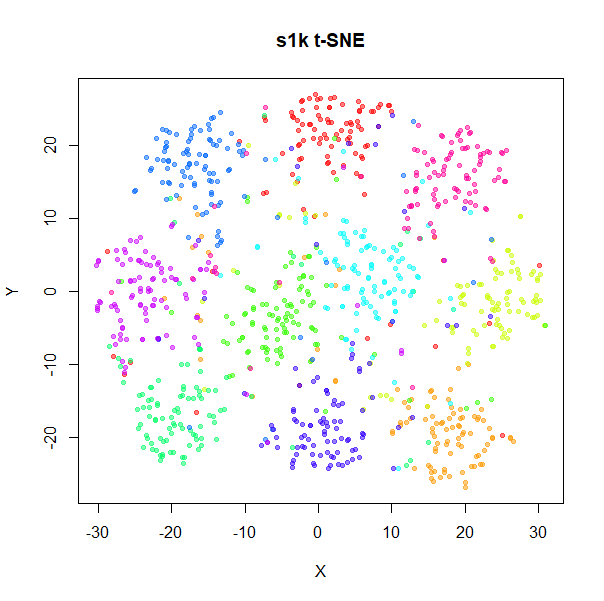

## oli

The [ORL database of faces](http://www.cl.cam.ac.uk/research/dtg/attarchive/facedatabase.html).

|                             |                           |
:----------------------------:|:--------------------------:
|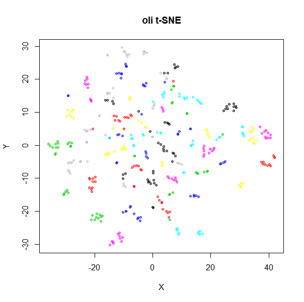

## frey

Images of Brendan Frey's face, as far as I know originating from a page belonging
to [Saul Roweis](https://cs.nyu.edu/~roweis/data.html).

|                             |                           |
:----------------------------:|:--------------------------:
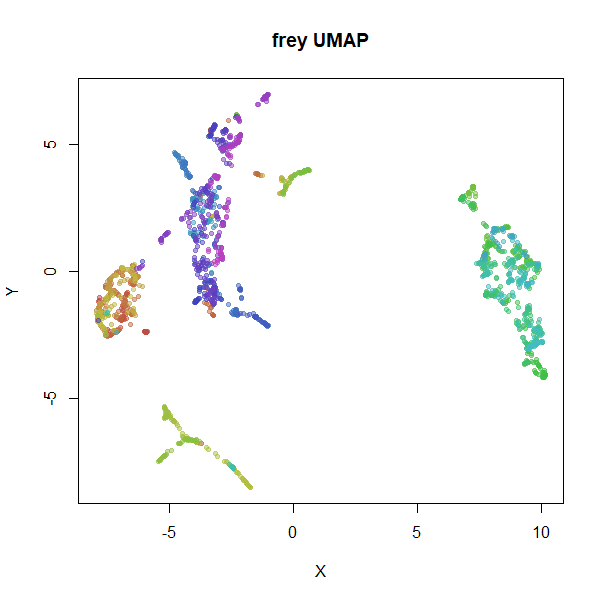|

## isofaces

Yet more faces, this time the dataset used in 
[Isomap](http://web.mit.edu/cocosci/isomap/datasets.html), consisting of images
of the same face under different rotations and lighting conditions. 
Unfortunately, it's no longer available at the MIT website, but it can be found
via [the Wayback Machine](https://web.archive.org/web/20160913051505/http://isomap.stanford.edu/face_data.mat.Z).
I wrote [a gist for processing the data in R](https://gist.github.com/jlmelville/339dfeb80c3e836e887d70a37679b244).

In the images below the points are colored by the first pose angle.

|                             |                           |
:----------------------------:|:--------------------------:
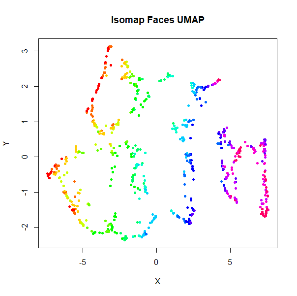|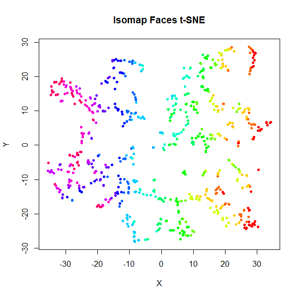

## swiss

The [Swiss Roll](http://web.mit.edu/cocosci/isomap/datasets.html) data used in 
Isomap. A famous dataset, but perhaps not that representative of typical 
real world datasets. t-SNE is know to not handle this well, but UMAP makes
an impressive go at unfolding it.

## coil20

The [COIL-20 Columbia Object Image Library](http://www.cs.columbia.edu/CAVE/software/softlib/coil-20.php).

|                             |                           |
:----------------------------:|:--------------------------:
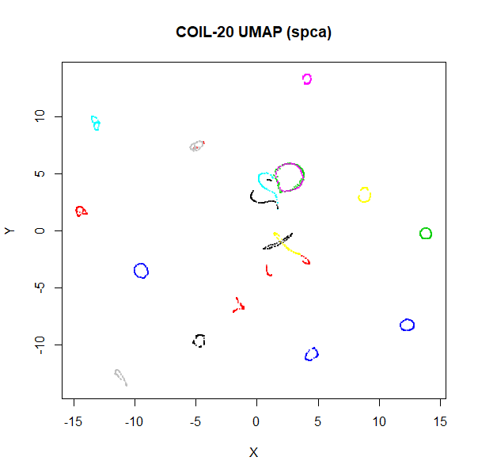|

## coil100

The [COIL-100 Columbia Object Image Library](http://www.cs.columbia.edu/CAVE/software/softlib/coil-100.php).

|                             |                           |
:----------------------------:|:--------------------------:
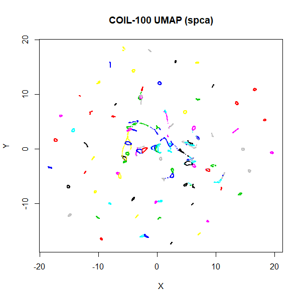|

The UMAP results are rather hard to visualize on a static plot. If you could
pan and zoom around, you would see that the rather indistinct blobs are mainly
correctly preserved loops. This is an example where choosing a different value
of the `a` and `b` parameters would be a good idea. The t-UMAP variant, 
available as `tumap` uses `a = 1`, `b = 1` (effectively using the same Cauchy
kernel as t-SNE) does a better job here and is shown below on the left. The 
correct choice of parameters is also important for t-SNE. On the right is
the t-SNE result with a default `perplexity = 50`, which does not retain as
much of the loop structure as the lower perplexity:

|                             |                           |
:----------------------------:|:--------------------------:
|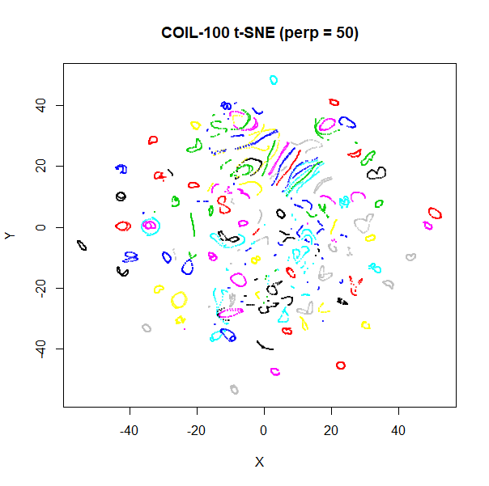

## swiss roll

The [Swiss Roll](http://web.mit.edu/cocosci/isomap/datasets.html) data used in 
Isomap. A famous dataset, but perhaps not that representative of typical 
real world datasets. t-SNE is know to not handle this well, but UMAP makes
an impressive go at unfolding it.

|                             |                           |
:----------------------------:|:--------------------------:
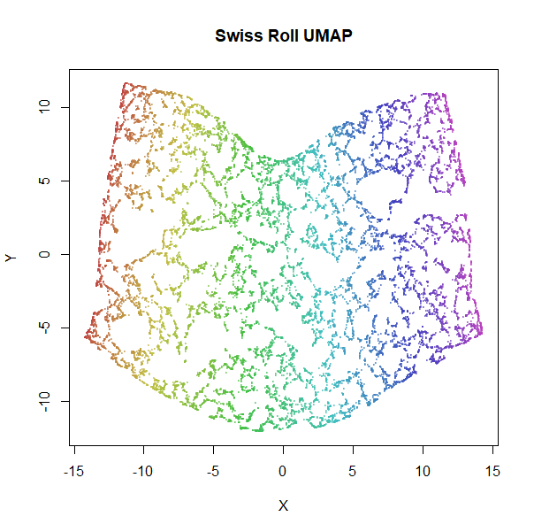|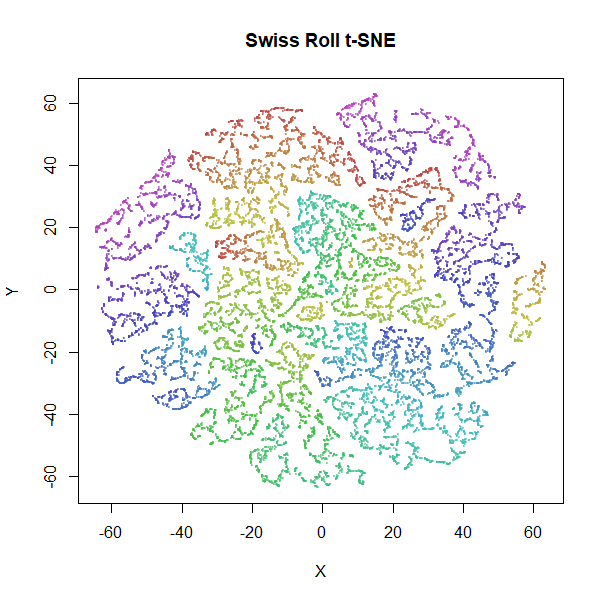

## mnist

The [MNIST database of handwritten digits](http://yann.lecun.com/exdb/mnist/).

|                             |                           |
:----------------------------:|:--------------------------:
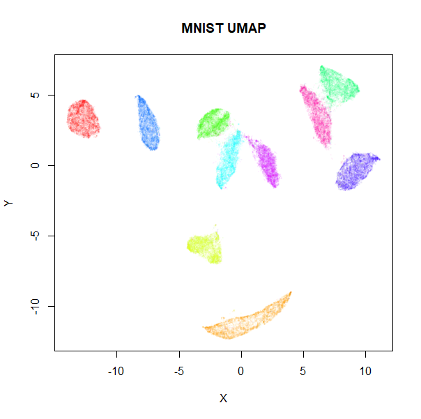|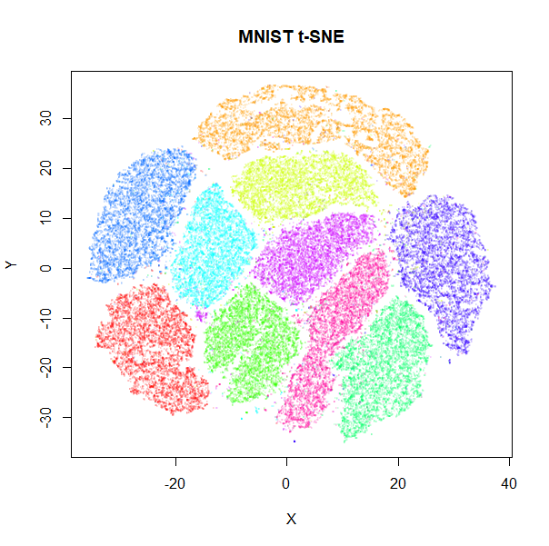

## fashion

The [Fashion MNIST database](https://github.com/zalandoresearch/fashion-mnist),
images of fashion objects.

|                             |                           |
:----------------------------:|:--------------------------:
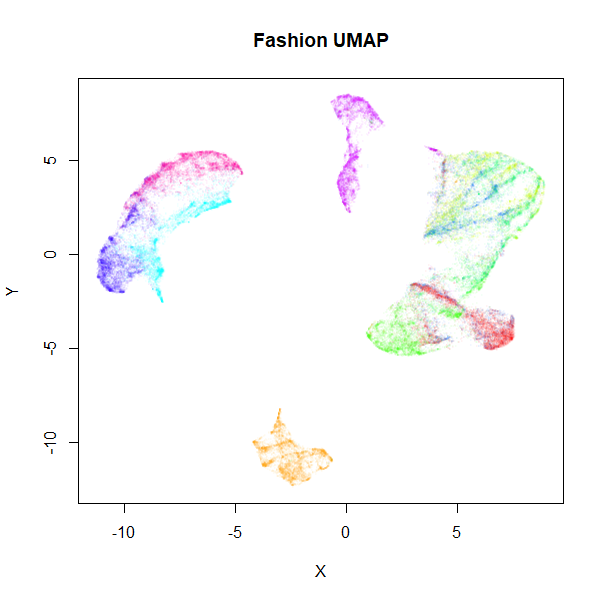|

## kuzushiji (KMNIST)

The [Kuzushiji MNIST database](https://github.com/rois-codh/kmnist), images of
cursive Japanese handwriting.

|                             |                           |
:----------------------------:|:--------------------------:
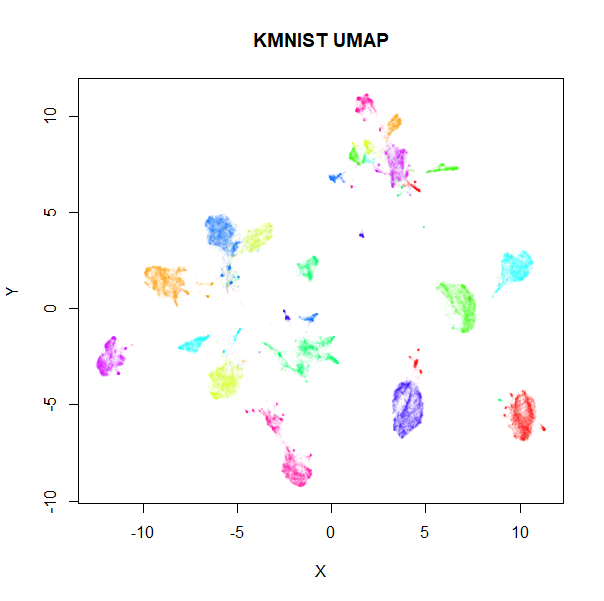|

## norb

The [small NORB dataset](https://cs.nyu.edu/~ylclab/data/norb-v1.0-small/),
pairs of images of 50 toys photographed at different angles and under different
lighting conditions.

|                             |                           |
:----------------------------:|:--------------------------:
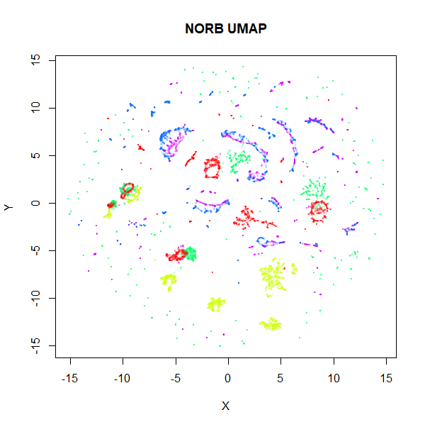|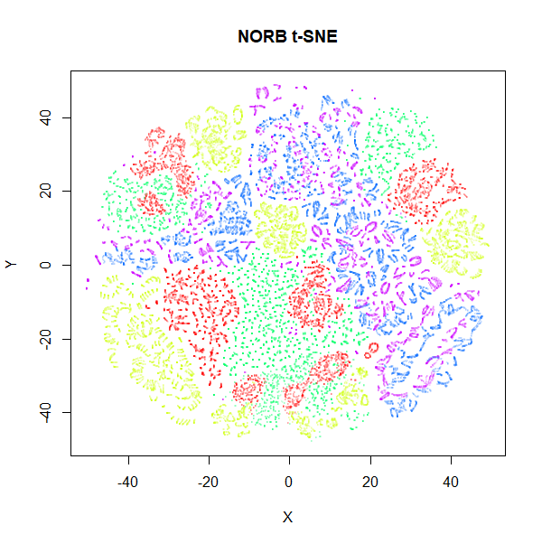

## cifar10

The [CIFAR-10 dataset](https://www.cs.toronto.edu/~kriz/cifar.html),
consisting of 60000 32 x 32 color images evenly divided across 10 classes 
(e.g. airplane, cat, truck, bird). t-SNE was applied to CIFAR-10 in the 
[Barnes-Hut t-SNE paper](http://jmlr.org/papers/v15/vandermaaten14a.html), but
in the main paper, only the results after passing through a convolutional neural
network were published. t-SNE on the original pixel data was only given in the 
[supplementary information (PDF)](https://lvdmaaten.github.io/publications/misc/Supplement_JMLR_2014.pdf)
which is oddly hard to find a link to via JMLR or the article itself.

|                             |                           |
:----------------------------:|:--------------------------:
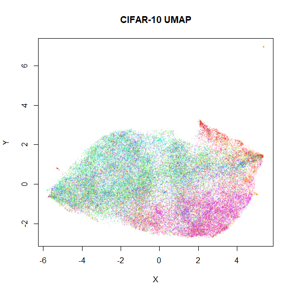|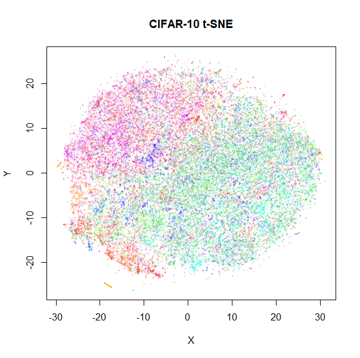

There is an outlying orange cluster (which isn't easy to see) in the top right
of the UMAP plot. I see the same thing in the Python implementation, so I don't
think this is a bug in `uwot` (although I also said that in a previous version
of this page, and it turned out there *was* a bug in `uwot`. The current result
really is closer to the Python version now, though). That cluster of images is
of some automobiles but they all seem to be variations of the same image. The
same cluster is present in the t-SNE plot (bottom left), but is more comfortably
close to the rest of the data.

The existence of these near-duplicates in CIFAR-10 doesn't seem to have been 
widely known or appreciated until quite recently, see for instance
[this twitter thread](https://twitter.com/colinraffel/status/1030532862930382848)
and [this paper by Recht and co-workers](https://arxiv.org/abs/1806.00451).
Such manipulations are in line with the practice of data augmentation that is
popular in deep learning, but you would need to be aware of it to avoid the
test set results being contaminated. These images seem like a good argument for 
applying UMAP or t-SNE to your dataset as a way to spot this sort of thing.

We can get better results with UMAP by using the scaled PCA initialization 
(below on the left) and by using the t-UMAP settings (below, right):

|                             |                           |
:----------------------------:|:--------------------------:
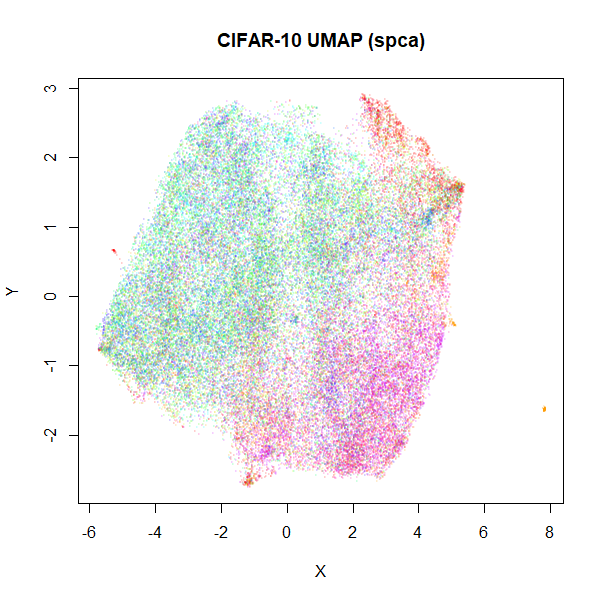|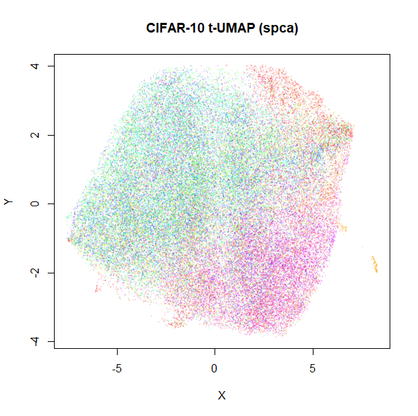

That rogue cluster is still present (off to the lower right now), but either
image is more comparable to the t-SNE result.

As the visualization of CIFAR-10 isn't very successful with UMAP or t-SNE, here
are some results using the activations of a convnet, similar to that used in
the BH t-SNE paper. For the convnet, I used a [keras](https://keras.io/) 
implementation, taken from the 
[Machine Learning in Action blog](https://appliedmachinelearning.blog/2018/03/24/achieving-90-accuracy-in-object-recognition-task-on-cifar-10-dataset-with-keras-convolutional-neural-networks/). Features were Z-scaled as
carried out in the blog, but I used 100 epochs and a batch size of 128 and I also
used the [RMSprop (PDF)](https://www.cs.toronto.edu/~tijmen/csc321/slides/lecture_slides_lec6.pdf) 
optimizer favored in the 
[Deep Learning with Python book](https://www.manning.com/books/deep-learning-with-python)
(with `lr=1e-4` and `decay=1e-6`). Without any data augmentation, this gave a 
test set error of `0.1655`, slightly lower than the test set result given in the
BH t-SNE paper (which used a different architecture and without the benefit of
an extra 4 years of deep learning research). After retraining with all 60000
images, the flattened output of the final max-pool layer was used, giving 2048
features (the BH t-SNE paper network had 1024 output activations). UMAP and
t-SNE results are below. For the UMAP results, I used the t-UMAP settings with
scaled PCA initialization.

|                             |                           |
:----------------------------:|:--------------------------:
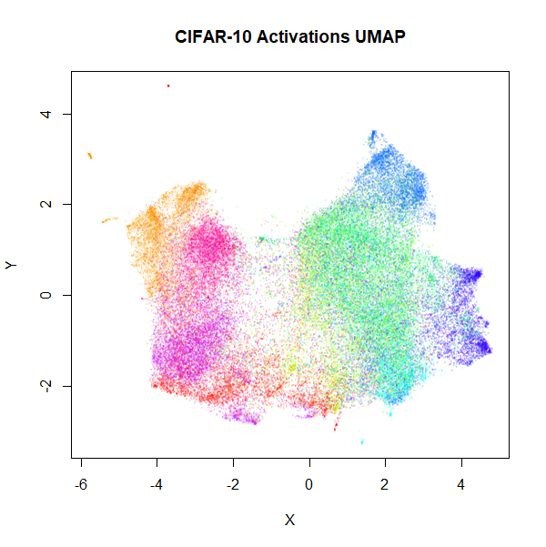|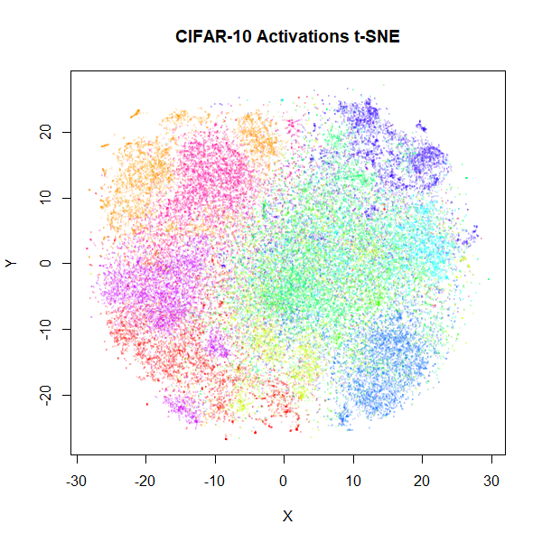

Results don't look quite as good as those in the BH t-SNE paper, but they are
still an improvement. The orange cluster of automobiles remains as an outlier,
even in the activation space. You can also see it in the BH t-SNE paper in the 
lower image in Figure 5 (orange cluster at the bottom, slightly left of center).


## tasic2018

The `tasic2018` dataset is a transcriptomics dataset of mouse brain cell RNA-seq
data from the [Allen Brain Atlas](http://celltypes.brain-map.org/rnaseq/mouse)
(originally reported by 
[Tasic and co-workers](http://dx.doi.org/10.1038/s41586-018-0654-5).
There is gene expression data for 14,249 cells from the primary visual cortex,
and 9,573 cells from the anterior lateral motor cortex to give a dataset of size
n = 23,822 overall. Expression data for 45,768 genes were obtained in the
original data, but the dataset used here follows the pre-processing treatment of
[Kobak and Berens](https://doi.org/10.1101/453449) which applied a normalization
and log transformation and then only kept the top 3000 most variable genes.

The data can be generated from the Allen Brain Atlas website and processed 
in Python by following the instructions in this 
[Berens lab notebook](https://github.com/berenslab/rna-seq-tsne/blob/master/demo.ipynb).
I output the data to CSV format for reading into R and assembling into a data
frame with the following extra exporting code:

```python
np.savetxt("path/to/allen-visp-alm/tasic2018-log3k.csv", logCPM, delimiter=",")
np.savetxt("path/to/allen-visp-alm/tasic2018-areas.csv", tasic2018.areas, delimiter=",", fmt = "%d")
np.savetxt("path/to/allen-visp-alm/tasic2018-genes.csv", tasic2018.genes[selectedGenes], delimiter=",", fmt='%s')
np.savetxt("path/to/allen-visp-alm/tasic2018-clusters.csv", tasic2018.clusters, delimiter=",", fmt='%d')
np.savetxt("path/to/allen-visp-alm/tasic2018-cluster-names.csv", tasic2018.clusterNames, delimiter=",", fmt='%s')
np.savetxt("path/to/allen-visp-alm/tasic2018-cluster-colors.csv", tasic2018.clusterColors, delimiter=",", fmt='%s')
```

|                             |                           |
:----------------------------:|:--------------------------:
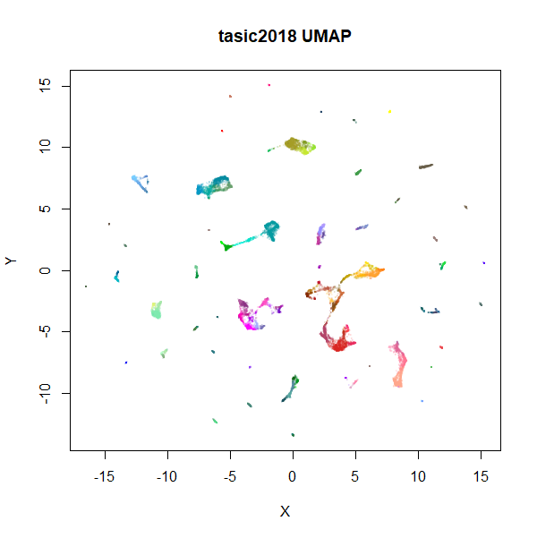|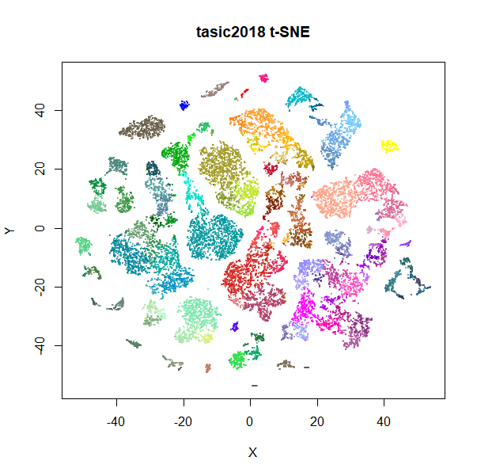

Again, the default UMAP settings produce clusters that are bit too well-separated
to clearly see in these images. So here are the results from using t-UMAP (the
same as setting `a = 1, b = 1`), on the left, and then using `a = 2, b = 2` on
the right:

|                             |                           |
:----------------------------:|:--------------------------:
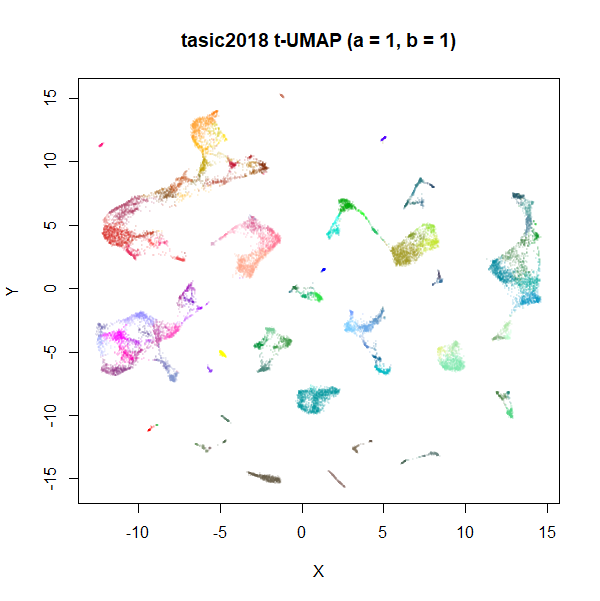|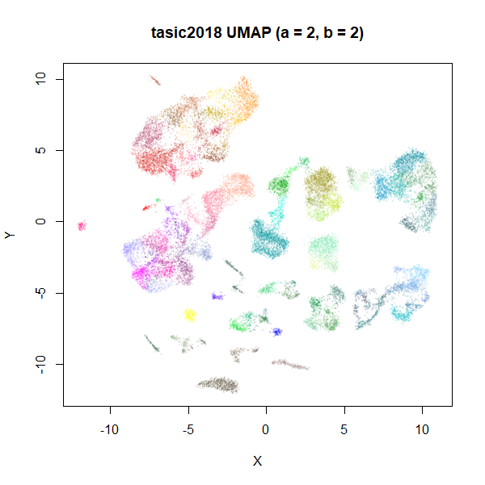

## macosko2015

Another [transcriptomics data set](https://doi.org/10.1016/j.cell.2015.05.002), 
used as an example in [openTSNE](https://github.com/pavlin-policar/openTSNE).
This contains data for 44,808 cells from the mouse retina. 

The raw data was fetched similarly to this [shell script from the Hemberg Lab](https://github.com/hemberg-lab/scRNA.seq.datasets/blob/master/bash/macosko.sh)
and then the data was prepared using the 
[openTSNE notebook by Pavlin Policar](https://github.com/pavlin-policar/openTSNE/blob/master/examples/prepare_macosko_2015.ipynb).
Similarly to the `tasic2018` dataset, data was log normalized and the 3,000 most variable genes were retained.

I exported the data (without the Z-scaling and PCA dimensionality reduction),
as a CSV file, e.g.:

```python
np.savetxt("/path/to/macosko2015/macosko2015-log3k.csv", x, delimiter=",")
# Use these as column names
np.savetxt("/path/to/macosko2015/macosko2015-genenames.csv", data.T.columns.values[gene_mask].astype(str), delimiter=",", fmt = "%s")
np.savetxt("/path/to/macosko2015/macosko2015-clusterids.csv", cluster_ids.values.astype(int), delimiter=",", fmt = "%d")
```

|                             |                           |
:----------------------------:|:--------------------------:
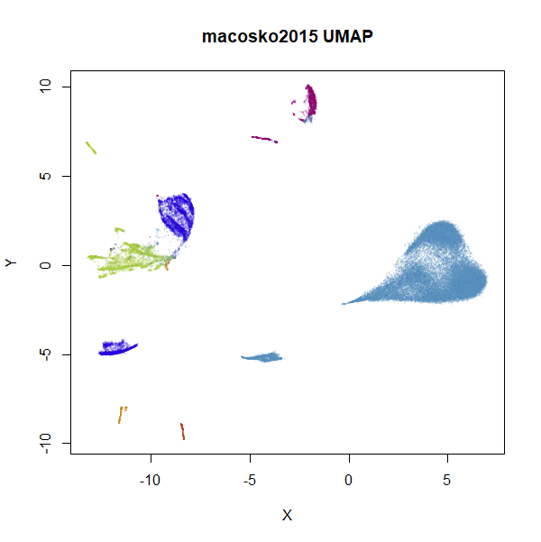|

This is another result where the UMAP defaults might need a bit of fiddling with
if you don't like how separated the clusters are.

The openTSNE results use Z-scaling of the inputs before applying t-SNE, so below
are the results for UMAP and t-SNE with Z-scaling applied (for `umap`, pass
`scale = "Z"` as an argument so you don't have to do it manually):

|                             |                           |
:----------------------------:|:--------------------------:
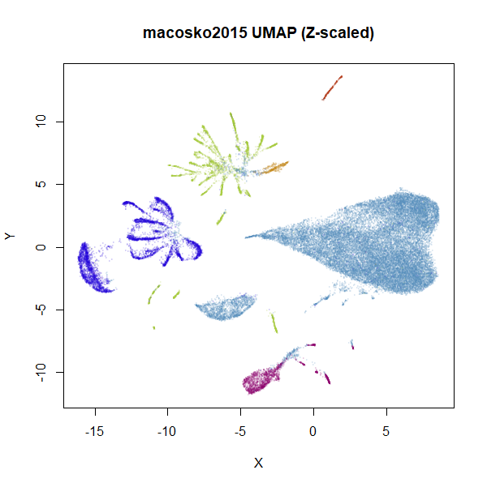|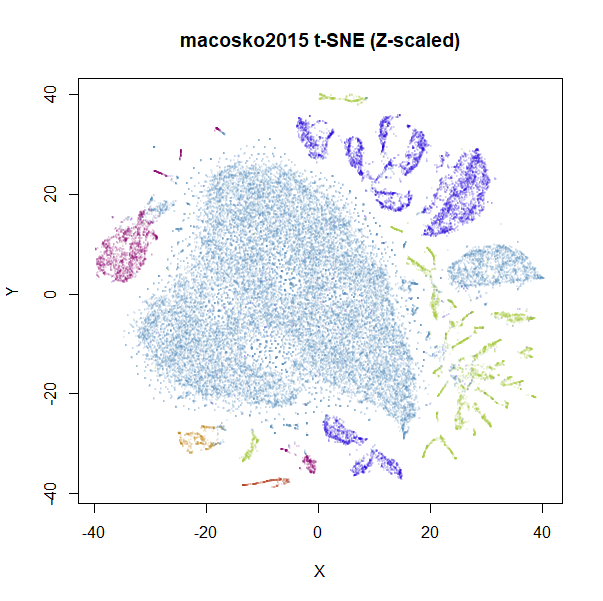
