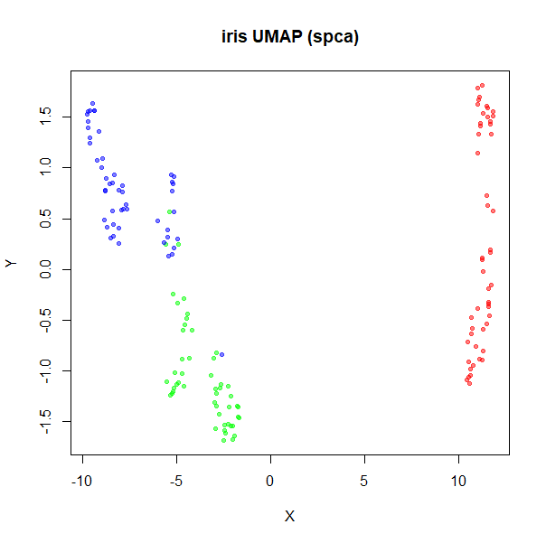
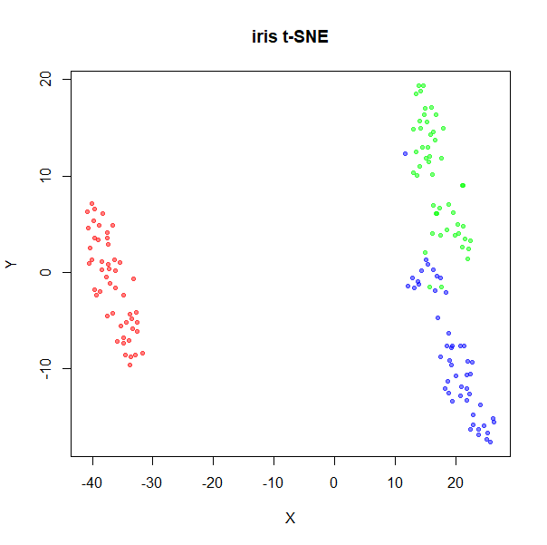
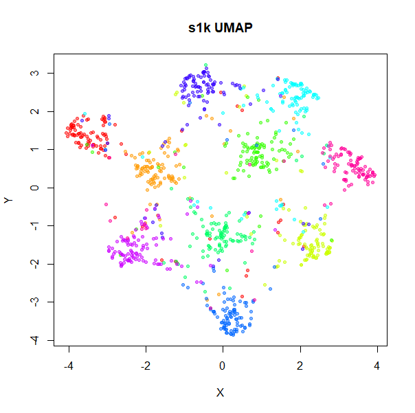
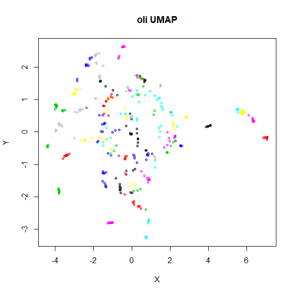
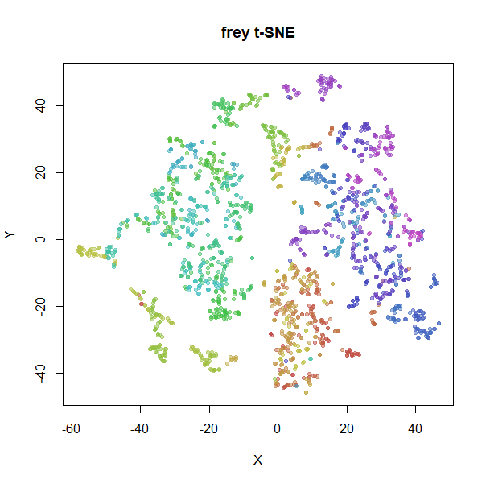
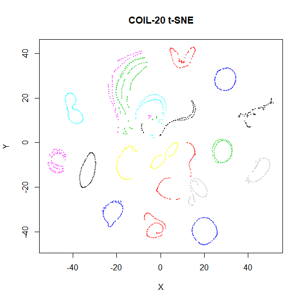
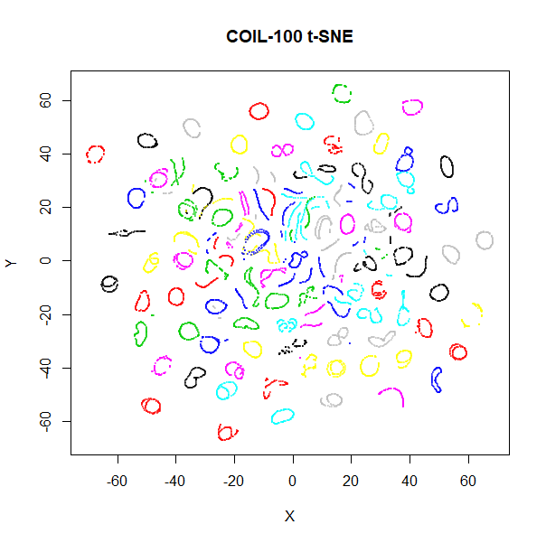
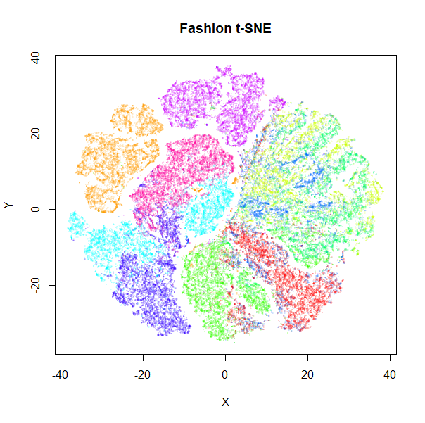
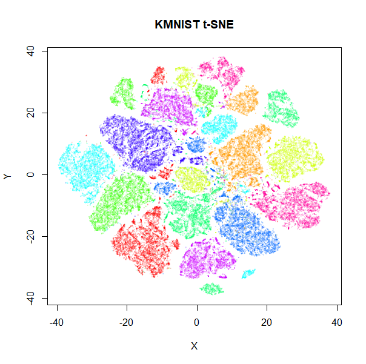

This is part of the documentation for [UWOT](https://github.com/jlmelville/uwot).

*December 29 2018* New, better settings for t-SNE, better plots and a couple of
new datasets. Removed neighborhood preservation values until I've double checked
they are working correctly.

Here are some examples of the output of `uwot`'s implementation of UMAP, 
compared to t-SNE output. 

## Data preparation

For details on the datasets, follow their links. Somewhat more detail is also
given in the 
[smallvis documentation](https://jlmelville.github.io/smallvis/datasets.htm). 
`iris` you already have if you are using R. `s1k` is part of the
[sneer](https://github.com/jlmelville/sneer) package. `frey`, `oli`, `mnist`,
`fashion` and `kuzushiji` can be downloaded via
[snedata](https://github.com/jlmelville/snedata). `coil20` and `coil100` can be
fetched via [coil20](https://github.com/jlmelville/coil20).

```R
mnist <- snedata::download_mnist()

# For some functions we need to strip out non-numeric columns and convert data to matrix
x2m <- function(X) {
  if (!methods::is(X, "matrix")) {
    m <- as.matrix(X[, which(vapply(X, is.numeric, logical(1)))])
  }
  else {
    m <- X
  }
  m
}
```

At the time I generated this document (late December 2018), the `kuzushiji`
dataset had some duplicate and all-black images that needed filtering. This
seems to have been remedied as of early February 2019. I re-ran both UMAP and
t-SNE on the fixed dataset, but the results weren't noticeably different. For
the record, the clean-up routines I ran were:

```R
# Remove all-black images in Kuzushiji MNIST (https://github.com/rois-codh/kmnist/issues/1)
kuzushiji <- kuzushiji[-which(apply(x2m(kuzushiji), 1, sum) == 0), ]
# Remove duplicate images (https://github.com/rois-codh/kmnist/issues/5)
kuzushiji <- kuzushiji[-which(duplicated(x2m(kuzushiji))), ]
```

## UMAP settings

For UMAP, I stick with the defaults, with the exception of `iris`, `coil20`,
and `coil100`. The spectral initialization with the default `n_neighbors` leads
to disconnected components, which can lead to a poor global picture of the data.
The Python UMAP implementation goes to fairly involved lengths to ameliorate
theses issues, but `uwot` does not.

For these datasets, a perfectly good alternative that provides a global
initialization is to use the first two components from PCA, scaled so their 
standard deviations are initially 1e-4 (via `init = "spca"`). This usually 
results in an embedding which isn't too different from starting via the raw 
PCA but is more compact, i.e. less space between clusters. For visualizations,
as long as the relative orientation and rough distances between clusters are 
maintained, the exact distances between them are not that interesting to me.

```R
# For iris 
iris_umap <- umap(iris, init = "spca")

# Small datasets (s1k, oli, frey)
s1k_umap <- umap(s1k)

# Big datasets (mnist, fashion, kuzushiji)
mnist_umap <- umap(mnist, pca = 100)

# coil20 and coil100
coil20_umap <- umap(coil20, pca = 100, init = "spca")
```

## t-SNE settings

The [Rtsne](https://cran.r-project.org/package=Rtsne) package was used for the
t-SNE calculations, except for the `iris` dataset, proving troublesome once
again. This time it's because `Rtsne` doesn't allow for duplicates. For `iris`
only, I used the [smallvis](https://github.com/jlmelville/smallvis) package.

For t-SNE, I also employ the following non-defaults:

* `perplexity = 15`, which is closer to the neighborhood size used by UMAP
* for large datasets, `initial_dims = 100`, rather than the usual `50` just to
ensure there is no distortion from the initial PCA. 
* As `uwot` also makes use of `irlba`, there is no reason not to use 
`partial_pca`.

It would be nice to use the same initial coordinates for both methods,
but unfortunately `Rtsne` doesn't apply early exaggeration with user-supplied 
input. Without early exaggeration, t-SNE results aren't as good, especially with 
larger datasets. Therefore the t-SNE plots use a random initialization. 

```R
# For iris only
iris_tsne <- smallvis::smallvis(iris, perplexity = 15, Y_init = "rand", exaggeration_factor = 4)

# Small datasets (s1k, oli, frey)
s1k_tsne <- Rtsne::Rtsne(x2m(s1k), perplexity = 15, initial_dims = 100,
                       partial_pca = TRUE, exaggeration_factor = 4)

# Big datasets (coil20, coil100, mnist, fashion, kuzushiji)
mnist_tsne <- Rtsne::Rtsne(x2m(mnist), perplexity = 15, initial_dims = 100,
                       partial_pca = TRUE, exaggeration_factor = 12)
```

### Visualization

For visualization, I used the [vizier](https://github.com/jlmelville/vizier)
package. The plots are colored by class membership (there's an obvious choice
for every dataset considered), except for `frey`, where the points are colored
according to their position in the sequence of images.

```R
embed_img <- function(X, Y, k = 15, ...) {
  args <- list(...)
  args$coords <- Y
  args$x <- X

  do.call(vizier::embed_plot, args)
}
embed_img(iris, iris_umap, pc_axes = TRUE, equal_axes = TRUE, alpha_scale = 0.5, title = "iris UMAP", cex = 1)
```

For UMAP, where non-default initialization was used, it's noted in the title
of the plot (e.g. "(spca)").

## iris

The standard `iris` dataset, known and loved by all.

|                             |                           |
:----------------------------:|:--------------------------:
|

## s1k

A 9-dimensional fuzzy simplex, which I created for testing t-SNE and related
methods, original in the [sneer](https://github.com/jlmelville/sneer) package.

|                             |                           |
:----------------------------:|:--------------------------:
|

## oli

The [ORL database of faces](http://www.cl.cam.ac.uk/research/dtg/attarchive/facedatabase.html).

|                             |                           |
:----------------------------:|:--------------------------:
|

## frey

Images of Brendan Frey's face, as far as I know originating from a page belonging
to [Saul Roweis](https://cs.nyu.edu/~roweis/data.html).

|                             |                           |
:----------------------------:|:--------------------------:
|

## coil20

The [COIL-20 Columbia Object Image Library](http://www.cs.columbia.edu/CAVE/software/softlib/coil-20.php).

|                             |                           |
:----------------------------:|:--------------------------:
|

## coil100

The [COIL-100 Columbia Object Image Library](http://www.cs.columbia.edu/CAVE/software/softlib/coil-100.php).

|                             |                           |
:----------------------------:|:--------------------------:
|

The UMAP results are rather hard to visualize on a static plot. If you could
pan and zoom around, you would see that the rather indistinct blobs are mainly
correctly preserved loops. This is an example where choosing a different value
of the `a` and `b` parameters would be a good idea. The t-UMAP variant, 
available as `tumap` uses `a = 1`, `b = 1` (effectively using the same Cauchy
kernel as t-SNE) does a better job here and is shown below on the left. The 
correct choice of parameters is also important for t-SNE. On the right is
the t-SNE result with a default `perplexity = 50`, which does not retain as
much of the loop structure as the lower perplexity:

|                             |                           |
:----------------------------:|:--------------------------:
|


## mnist

The [MNIST database of handwritten digits](http://yann.lecun.com/exdb/mnist/).

|                             |                           |
:----------------------------:|:--------------------------:
|

## fashion

The [Fashion MNIST database](https://github.com/zalandoresearch/fashion-mnist),
images of fashion objects.

|                             |                           |
:----------------------------:|:--------------------------:
|

## kuzushiji (KMNIST)

The [Kuzushiji MNIST database](https://github.com/rois-codh/kmnist), images of
cursive Japanese handwriting.

|                             |                           |
:----------------------------:|:--------------------------:
|

The more compact nature of UMAP's results compared to t-SNE is obvious for all
datasets.
